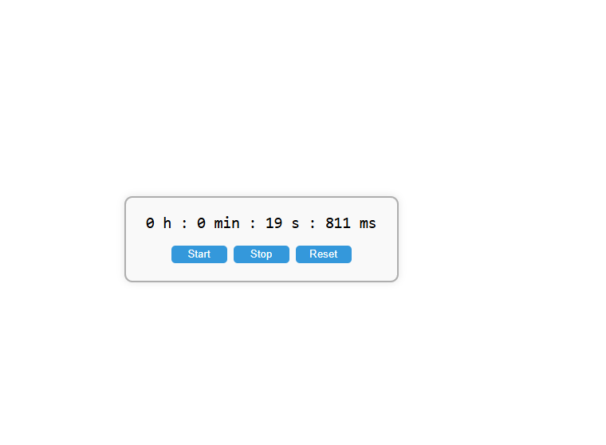

# ⏱️ Chronomètre Web

Un petit projet web de chronomètre interactif développé en HTML, CSS et JavaScript.  
Il permet de démarrer, arrêter, et réinitialiser un chronomètre affiché dans un joli cadre centré.

---

## 📸 Aperçu

  
*(Ajoute une capture d'écran dans le dossier si tu veux)*

---

## 🚀 Fonctionnalités

- ✅ Démarrage du chronomètre
- ✅ Pause et reprise sans perte de temps
- ✅ Réinitialisation à zéro
- ✅ Affichage du temps écoulé (heures, minutes, secondes, millisecondes)
- ✅ Interface visuelle responsive et centrée

---

## 🛠️ Technologies utilisées

- HTML5
- CSS3 (Flexbox pour le centrage)
- JavaScript Vanilla (`setInterval`, `Date.now()`)

source : www.exelib.net